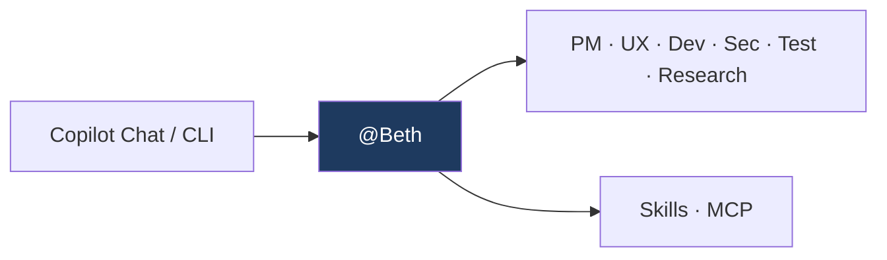
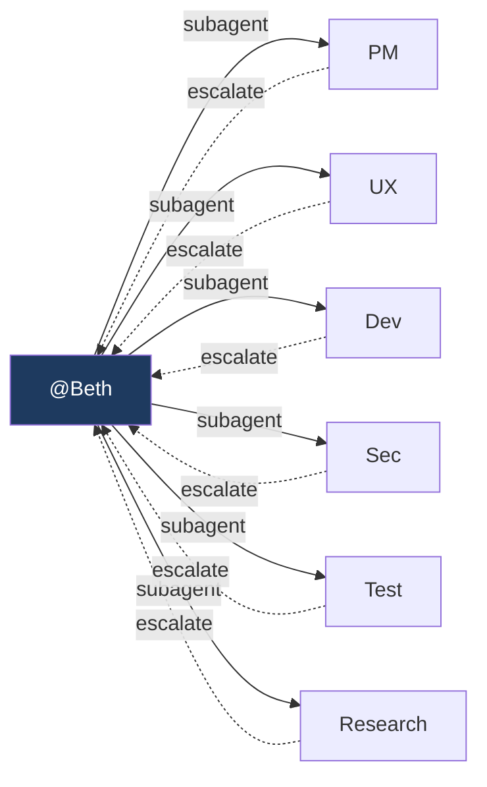
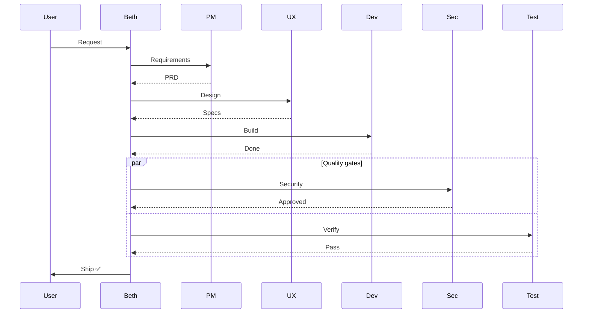
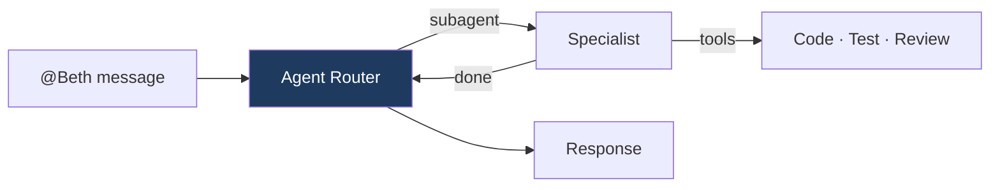
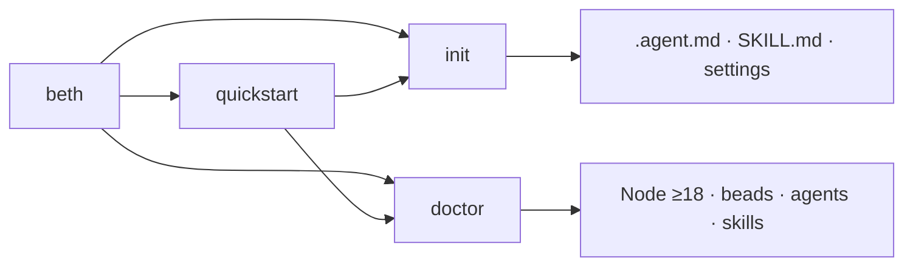
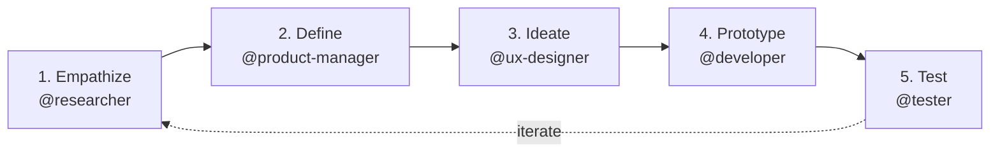
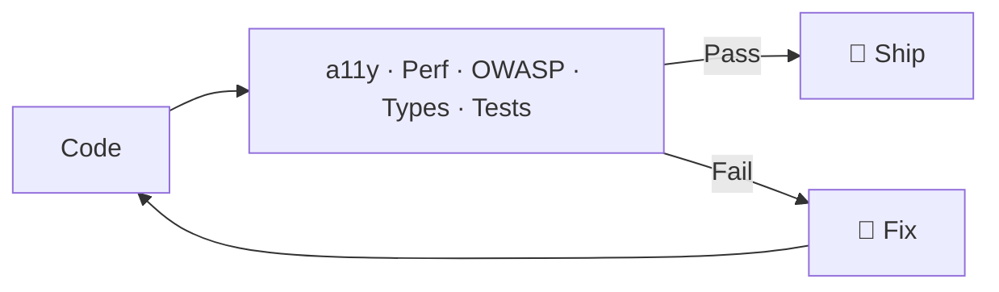

# Beth

<p align="center">
  
</p>

She doesn't do excuses. She doesn't do hand-holding. She does results—and she'll have your entire project shipping while everyone else is still scheduling their kickoff meeting. Think of her as the managing director your codebase didn't know it needed, but absolutely deserves.

They broke her wings once. They forgot she had claws.

---

## What Is This?

Beth is a **multi-agent AI orchestrator** with a TypeScript runtime, CLI toolchain, MCP integrations, and subagent delegation—all driven by a ruthless coordinator who runs your development team the way Beth Dutton runs Schwartz & Meyer.

She commands seven specialized agents, each with their own expertise, tools, and handoff chains. On top of the GitHub Copilot agent layer, Beth ships a **TypeScript core engine** with a full agentic loop: agent routing, conversation context management, tool calling, subagent spawning, and agent handoffs—all backed by an Azure OpenAI LLM provider with streaming and retry.

**The system has four execution layers:**

| Layer | What It Does | Status |
|-------|-------------|--------|
| **Copilot Agents** | `.agent.md` definitions running in VS Code Agent Mode | Live |
| **CLI Toolchain** | `beth init`, `beth doctor`, `beth close`, `beth land` — TypeScript commands | Live |
| **Orchestration Engine** | Fan-out routing, tool calling loop, subagent spawning, handoffs | Live |
| **Tool Abstraction** | 6 CLI tools + MCP bridge — uniform interface for all agent capabilities | Live |
| **LLM Provider** | Azure OpenAI with Entra ID auth, streaming, retry, tool calling | Live |

**478 tests.** 477 pass, 1 skip, 0 fail.

---

## Architecture



---

## Tech Stack

| Category | Technology | Notes |
|----------|-----------|-------|
| **Runtime** | Node.js ≥ 18 | ES modules, built-in test runner |
| **Language** | TypeScript (strict mode) | No `any`. Zod for runtime validation |
| **Target Framework** | React 19 + Next.js App Router | Server Components, Server Actions, Suspense, streaming |
| **Styling** | Tailwind CSS + `class-variance-authority` (cva) | Utility-first with typed variants |
| **Components** | shadcn/ui | Radix primitives, copy-paste ownership |
| **LLM Provider** | Azure OpenAI via `openai` SDK | Entra ID auth (no API keys), streaming + tool calling |
| **Auth** | `@azure/identity` DefaultAzureCredential | az login, managed identity, VS Code creds |
| **Frontmatter** | `gray-matter` | Parses `.agent.md` and `SKILL.md` YAML |
| **Testing** | vitest + Node.js test runner | 478 tests — unit, integration, E2E |
| **Task Tracking** | beads (`bd` CLI) | Dependency-aware issue tracking for agents |
| **Package Manager** | npm | Lockfile committed |

**Production dependencies:** 2 (`gray-matter`, `bs-buster`). Minimal attack surface by design.

---

## Getting Started

**One command:**
```bash
npx beth-copilot init
```

**Global install:**
```bash
npm i -g beth-copilot
beth init
```

Then open VS Code, switch Copilot Chat to **Agent mode**, and type `@Beth`.

**Verify everything works:**
```bash
beth doctor       # Health check: Node.js, beads, agents, skills
beth quickstart   # Init + doctor + beads setup in one shot
```

For detailed setup (prerequisites, task tracking, MCP servers): [docs/INSTALLATION.md](docs/INSTALLATION.md)

---

## CLI Commands

| Command | What It Does |
|---------|-------------|
| `beth init` | Install agents, skills, VS Code settings, beads tracking, pre-push hook |
| `beth init --force` | Overwrite existing files |
| `beth doctor` | Validate Node.js ≥18, beads CLI, agents frontmatter, skills |
| `beth quickstart` | Run init + doctor + beads init in one shot |
| `beth close <id>` | Close a beads issue with 3-layer enforcement (deps, children, test subtasks) |
| `beth land` | Automate session completion: tests, backup, commit, push, verify sync |
| `beth help` | Show all commands and options |

**Flags:** `--force`, `--skip-backlog`, `--skip-mcp`, `--skip-beads`, `--verbose`, `--skip-tests`, `--skip-backup`, `--message/-m`, `--dry-run`

---

## Agent Orchestration

Beth doesn't micromanage. She delegates to specialists over **subagent** and **handoff** channels, tracks dependencies with beads, and holds every agent accountable.

### The Family

| Agent | Role | What They Do |
|-------|------|--------------|
| **@Beth** | The Boss | Orchestrates everything. Routes work. Takes names. |
| **@product-manager** | The Strategist | WHAT to build: PRDs, user stories, priorities, success metrics |
| **@researcher** | The Intelligence | Competitive analysis, user insights, market dirt |
| **@ux-designer** | The Architect | HOW it works: component specs, design tokens, accessibility |
| **@developer** | The Builder | React/TypeScript/Next.js — UI and full-stack |
| **@tester** | The Enforcer | Quality assurance, accessibility, performance |
| **@security-reviewer** | The Bodyguard | OWASP, compliance, threat modeling |

### Delegation Model (Hub-and-Spoke)



All agents escalate exclusively to Beth — no lateral handoffs. Beth routes, agents execute.

### Subagent vs Handoff

| Mechanism | Control | Use When |
|-----------|---------|----------|
| **Subagent** | Beth decides | Task can run autonomously, no human review needed |
| **Handoff** | User decides | User needs to review before proceeding |

```typescript
// Beth spawns a specialist — autonomous execution
runSubagent({
  agentName: "developer",
  prompt: "Implement JWT auth flow with refresh token rotation...",
  description: "Implement auth"
})
```

### Workflow: New Feature



**Bug Hunt?** Tester → Developer → Security → Tester
**Security Audit?** Security → Developer → Tester → Security sign-off

---

## MCP Integrations

Model Context Protocol servers extend agent capabilities. All **optional** — agents gracefully degrade without them.

| Server | Agent | Capability |
|--------|-------|-----------|
| **shadcn/ui** | Developer | Component browsing & installation |
| **Playwright** | Tester | Browser automation, E2E testing |
| **Azure** | Developer, Security | Cloud resource management |
| **Brave Search** | Researcher | Internet research |
| **DeepWiki** | All | Repository documentation lookup |

### Quick Setup

```bash
# Copy example config and enable what you need
cp mcp.json.example .vscode/mcp.json
```

```json
{
  "servers": {
    "shadcn":     { "command": "npx", "args": ["shadcn@latest", "mcp"] },
    "playwright": { "command": "npx", "args": ["@playwright/mcp@latest"] },
    "azure":      { "command": "npx", "args": ["@azure/mcp-server"] },
    "web-search": { "command": "npx", "args": ["@brave/brave-search-mcp-server"] },
    "deepwiki":   { "url": "https://mcp.deepwiki.com/mcp" }
  }
}
```

Full details: [docs/MCP-SETUP.md](docs/MCP-SETUP.md)

---

## Skills (On-Demand Knowledge)

Skills are domain-knowledge modules that agents load automatically when trigger phrases match. Each skill lives in `.github/skills/<name>/SKILL.md` or `.github/prompts/<name>/PROMPT.md`.

| Skill | Triggers On | Used By |
|-------|------------|---------|
| **PRD Generation** | "create a prd", "product requirements" | Product Manager |
| **UI UX Pro Max** | "design system", "color palette", "style guide" | UX Designer, Developer |
| **Web Design Guidelines** | "review my UI", "check accessibility" | UX Designer, Tester |
| **Framer Components** | "framer component", "property controls" | UX Designer, Developer |
| **React/Next.js Best Practices** | React performance, Next.js patterns | Developer |
| **shadcn/ui** | "shadcn", "ui component" | Developer |
| **Security Analysis** | "security review", "OWASP", "threat model" | Security Reviewer |
| **Azure Operations** | Azure resource management | Developer |
| **Web Search** | Internet research via Brave | Researcher |

### Design & UI Skills

Three complementary skills cover the full design-to-code pipeline. They don't overlap — each solves a different problem.

| Skill | What It Does | When You Need It |
|-------|-------------|------------------|
| **[UI UX Pro Max](https://github.com/nextlevelbuilder/ui-ux-pro-max-skill)** | Design system generator — picks styles, colors, typography, and layout patterns from a searchable database of 67 styles, 161 color palettes, 57 font pairings, and 161 industry-specific reasoning rules. | Starting a new project or page. "What should this look like?" |
| **Web Design Guidelines** | Code auditor — fetches live [Vercel Web Interface Guidelines](https://github.com/vercel-labs/web-interface-guidelines) and checks your actual files for accessibility, focus, form, and performance violations with `file:line` output. | Reviewing implemented code. "Is this built correctly?" |
| **Framer Components** | Framer platform SDK reference — `addPropertyControls`, `ControlType`, code overrides, `RenderTarget`, auto-sizing, and Framer Motion integration. | Building custom components inside Framer. "How do I make this work in Framer?" |

**Typical flow:** UI UX Pro Max generates the design system → Developer builds it → Web Design Guidelines audits the result. Framer Components is loaded only when targeting the Framer platform.

---

## How It Works

Beth runs inside VS Code Copilot Agent Mode. The `@Beth` agent parses requests, delegates to specialist agents via subagent spawning, and tracks work through beads.



**Key capabilities:**
- **Agent routing** — `@mention` parsing, subagent spawning, handoff chains
- **Skill injection** — Domain knowledge loaded on trigger phrases
- **Task tracking** — beads (`bd`) for epics, subtasks, dependencies
- **MCP integration** — Optional external tool servers (shadcn, Playwright, Azure)

```
@Beth implement the login page
→ Beth routes to @developer, tracks work in beads

@Beth review this PR for security vulnerabilities
→ Beth routes to @security-reviewer, injects security-analysis skill

@Beth plan the dashboard feature
→ Beth routes to @product-manager for requirements, then @ux-designer for specs
```

> Invoke Beth by selecting `@Beth` in VS Code Copilot Chat (Agent Mode).

---

## Tool Abstraction Layer

A uniform interface for all agent capabilities — file I/O, terminal, search, beads, subagent spawning, and MCP server tools. Tools expose OpenAI-compatible function calling schemas so the LLM can invoke them directly.

| Tool | What It Does | Key Features |
|------|-------------|-------------- |
| **readFile** | Read file contents | Line ranges, path validation, traversal guards |
| **editFile** | Atomic string replacement | Single-match enforcement, whitespace-safe |
| **search** | Ripgrep search | Node.js fallback, regex support, file filtering |
| **terminal** | Execute shell commands | `execFile('/bin/sh')` — no shell injection, timeouts |
| **beads** | Issue tracking | `bd create`, `npx beth-copilot close`, `bd list` via CLI wrapper |
| **subagent** | Spawn nested agents | Returns structured result for orchestrator to process |
| **MCP Bridge** | External tool servers | JSON-RPC 2.0 over stdio, JSONC config, namespaced tools |

```typescript
import { loadAgents, loadSkills, getInferableAgents, buildTriggerMap } from 'beth-copilot';

// Inspect loaded agent definitions
const { agents, errors: agentErrors } = loadAgents('.github/agents');
// → each AgentDefinition has: id, frontmatter (name, tools, handoffs), body

// Find agents available for subagent spawning
const subagents = getInferableAgents({ agents, errors: agentErrors });
// → agents with infer: true in frontmatter

// Inspect loaded skill modules and their trigger phrases
const { skills, errors: skillErrors } = loadSkills('.github/skills');
const triggerMap = buildTriggerMap({ skills, errors: skillErrors });
// → Map of trigger phrase → SkillDefinition for runtime injection
```

---

## CLI Toolchain

The CLI handles scaffolding and health checks — distributing agent and skill files to target projects.



**Commands:**
- `beth init` — Scaffold agents, skills, VS Code settings, beads tracking
- `beth doctor` — Validate Node.js, beads CLI, agent frontmatter, skill directories
- `beth quickstart` — Run init + doctor + beads init in one shot

---

## TypeScript Core

The engine that powers everything. Parses agent and skill definitions, manages conversations, routes requests, executes tools, and provides typed APIs for the full agentic loop.

### Project Structure

```
beth/
├── bin/
│   └── cli.js                      # CLI entry point (init, doctor, quickstart, help)
├── src/
│   ├── index.ts                    # Barrel exports (all public API)
│   ├── cli/commands/
│   │   ├── doctor.ts               # System health validation
│   │   └── quickstart.ts           # Guided setup flow
│   ├── core/
│   │   ├── orchestrator.ts         # Agentic loop: route → LLM → tools → response
│   │   ├── router.ts               # @mention routing, skill matching, agent lookup
│   │   ├── context.ts              # Conversation state, token truncation, skill injection
│   │   ├── handoffs.ts             # Agent handoff transfers, loop detection
│   │   ├── agents/
│   │   │   ├── types.ts            # AgentDefinition, AgentFrontmatter, AgentHandoff
│   │   │   └── loader.ts           # Parse .agent.md → typed definitions
│   │   └── skills/
│   │       ├── types.ts            # SkillDefinition, TriggerMap
│   │       └── loader.ts           # Parse SKILL.md, extract triggers, match queries
│   ├── lib/
│   │   └── pathValidation.ts       # Traversal/injection guards
│   ├── tools/
│   │   ├── interface.ts            # Tool interface + toToolDefinition()
│   │   ├── types.ts                # ToolError, ToolResult, ToolContext, ToolPermissions
│   │   ├── registry.ts             # ToolRegistry: register, get, list, getDefinitions
│   │   ├── cli/
│   │   │   ├── readFile.ts         # File reading with line ranges
│   │   │   ├── editFile.ts         # Atomic string replacement
│   │   │   ├── search.ts           # Ripgrep with Node.js fallback
│   │   │   ├── terminal.ts         # Secure command execution
│   │   │   ├── beads.ts            # Issue tracking via bd CLI
│   │   │   └── subagent.ts         # Agent spawning interface
│   │   └── mcp/
│   │       ├── client.ts           # JSON-RPC 2.0 over stdio
│   │       └── bridge.ts           # JSONC config, tool namespacing
│   └── providers/
│       ├── interface.ts            # LLMProviderBase abstract class
│       ├── azure.ts                # AzureOpenAIProvider (Entra ID, streaming, tools)
│       ├── types.ts                # 17 types: ChatMessage, ToolCall, LLMError, etc.
│       ├── retry.ts                # Exponential backoff with jitter
│       ├── config.ts               # Environment + dotfile config loader
│       └── streaming.ts            # StreamAccumulator, collectStream, mapStream
├── templates/
│   └── .github/
│       ├── agents/                 # 7 agent definitions (.agent.md)
│       └── skills/                 # 8 skill modules (SKILL.md)
└── docs/
    ├── INSTALLATION.md
    ├── MCP-SETUP.md
    ├── CLI-ARCHITECTURE.md
    └── SYSTEM-FLOW.md
```

### Test Coverage

**814 tests** (813 pass, 1 skip, 0 fail):

| Suite | Tests | What It Covers |
|-------|-------|---------------|
| **Orchestration** | | |
| Orchestrator | 30+ | Agentic loop, tool calling, subagent spawning, iteration limits |
| AgentRouter | 30+ | @mention routing, skill matching, agent resolution |
| ConversationContext | 30+ | Token truncation, skill injection, tool call repair |
| HandoffManager | 30+ | Context transfer, depth limits, ping-pong detection |
| **Tools** | | |
| Tool interface | 20+ | Tool → ToolDefinition conversion, schema validation |
| ToolRegistry | 20+ | Register, get, list, definitions, duplicate detection |
| readFile | 30+ | Line ranges, path validation, encoding |
| editFile | 30+ | String replacement, single-match enforcement |
| search | 30+ | Ripgrep, Node.js fallback, regex, file filtering |
| terminal | 30+ | Command execution, timeouts, output capture |
| beads | 30+ | bd CLI wrapper, create/close/list/ready |
| subagent | 30+ | Spawn interface, result marking, agent validation |
| MCP client | 30+ | JSON-RPC 2.0, protocol handshake, tool listing |
| MCP bridge | 30+ | JSONC parsing, tool namespacing, error handling |
| Tool suite | 10+ | createDefaultRegistry, integration tests |
| **Providers** | | |
| Provider types | 40+ | LLMError codes, ChatMessage shapes, ToolDefinition schemas |
| Provider retry | 40+ | Exponential backoff, jitter, transient error detection |
| Provider config | 30+ | Env precedence, dotenv parsing, URL validation |
| Provider streaming | 40+ | Chunk accumulation, tool call delta assembly |
| Provider Azure | 30+ | Message mapping, response mapping, error wrapping |
| **Core & CLI** | | |
| Agent loader | 30+ | Frontmatter parsing, validation, code fence stripping, handoffs |
| Skill loader | 30+ | Trigger extraction, query matching, trigger map building |
| CLI E2E | 52 | Init/doctor pipeline, MCP template validation, help output |
| Path validation | 33 | Traversal detection, injection prevention, allowlists |

---

## IDEO Design Thinking

Beth follows human-centered design methodology across agent workflows:



---

## Quality Standards

Beth doesn't ship garbage:

| Standard | Gate | Enforced By |
|----------|------|-------------|
| **WCAG 2.1 AA** | Accessibility compliance | UX Designer + Tester |
| **Core Web Vitals** | LCP < 2.5s, FID < 100ms, CLS < 0.1 | Developer |
| **OWASP Top 10** | Zero known vulnerabilities | Security Reviewer |
| **TypeScript Strict** | No `any` | Developer |
| **Test Coverage** | Unit + Integration + E2E | Tester |



---

## Quick Commands

Don't waste her time. Be direct.

```
@Beth Build me a dashboard for user analytics with real-time updates.
```

```
@Beth Security review for our authentication flow. Find the holes.
```

```
@developer Implement a drag-and-drop task board. Make it fast.
```

```
@security-reviewer OWASP top 10 assessment on our API endpoints.
```

```
@tester Accessibility audit. WCAG 2.1 AA. No excuses.
```

---

## Why Beth?

<p align="center">
  
</p>

Look, you *could* try to coordinate seven specialists yourself. You could context-switch between product strategy, security reviews, and accessibility audits while keeping your sanity intact.

Or you could let Beth handle it.

She's got the crew. She's got the workflows. She delegates like a managing director because that's exactly what she is. You bring the problem, she brings the people—and somehow, the code ships on time, secure, and accessible.

Is it magic? No. It's just competence with very good hair.

> *"I made two decisions in my life based on fear, and they almost ruined me. I'll never make another."*

---

## Requirements

- **Node.js** ≥ 18
- **VS Code** with GitHub Copilot extension
- **GitHub Copilot Chat** in Agent mode
- [**beads**](https://github.com/steveyegge/beads) for task tracking (`bd` CLI)

### Installing Beads

```bash
curl -fsSL https://raw.githubusercontent.com/steveyegge/beads/main/scripts/install.sh | bash
```

**Common beads issues:**
- `bd: command not found` — Add `~/.local/bin` to your PATH: `export PATH="$HOME/.local/bin:$PATH"`
- `bd doctor` warnings about metadata — Run `bd doctor --fix` to auto-repair
- JSONL corruption — Delete `.beads/` and re-initialize with `bd init`

```bash
# Verify beads is working
bd doctor
```

### Optional: MCP Servers

See [MCP Integrations](#mcp-integrations) above or [docs/MCP-SETUP.md](docs/MCP-SETUP.md) for setup.

---

## Documentation

| Doc | Purpose |
|-----|---------|
| [Installation Guide](docs/INSTALLATION.md) | Full setup: prerequisites, VS Code config, beads |
| [MCP Setup](docs/MCP-SETUP.md) | Optional server integrations |
| [CLI Architecture](docs/CLI-ARCHITECTURE.md) | Dual-interface design, implementation phases |
| [System Flow](docs/SYSTEM-FLOW.md) | Agent orchestration diagrams |
| [Contributing Guide](CONTRIBUTING.md) | How to contribute (PR process, review checklist) |
| [Changelog](CHANGELOG.md) | Version history |
| [Security Policy](SECURITY.md) | Vulnerability reporting |

---

## License

MIT — Take it. Run it. Build empires.

---

*Built with the kind of ferocity that would make John Dutton proud.*
