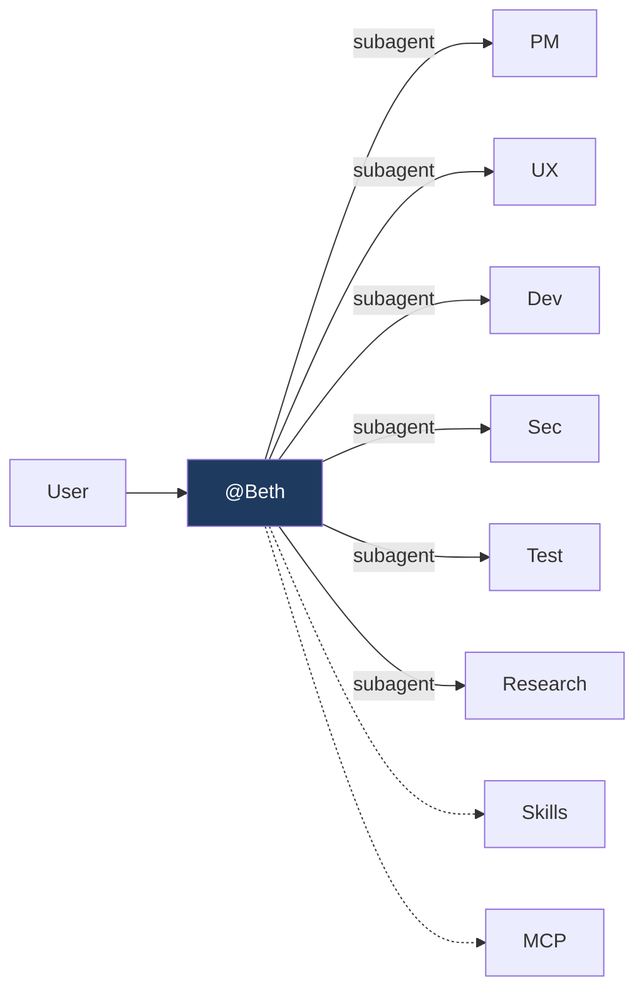
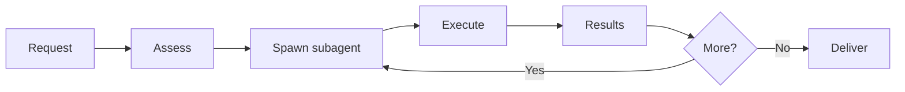
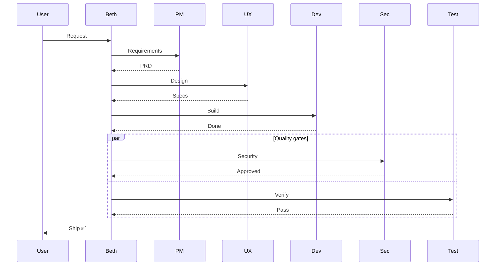
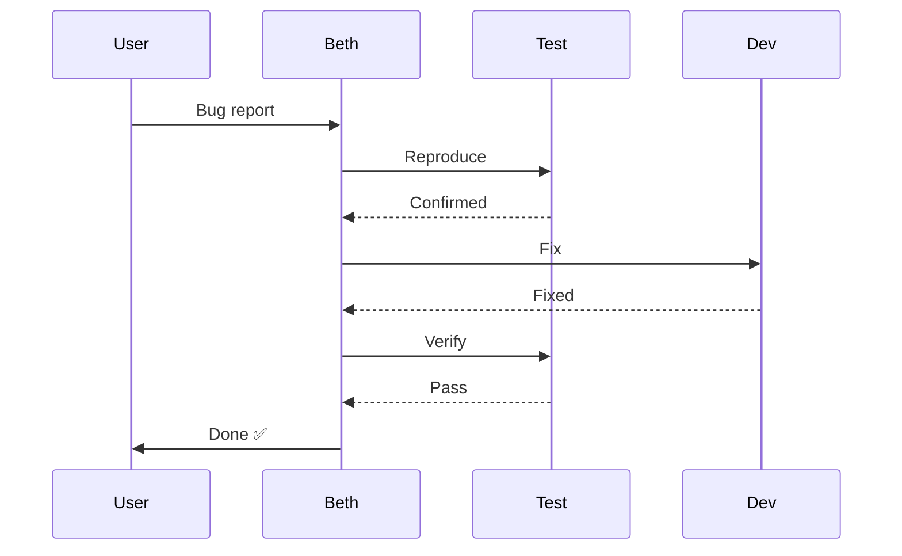
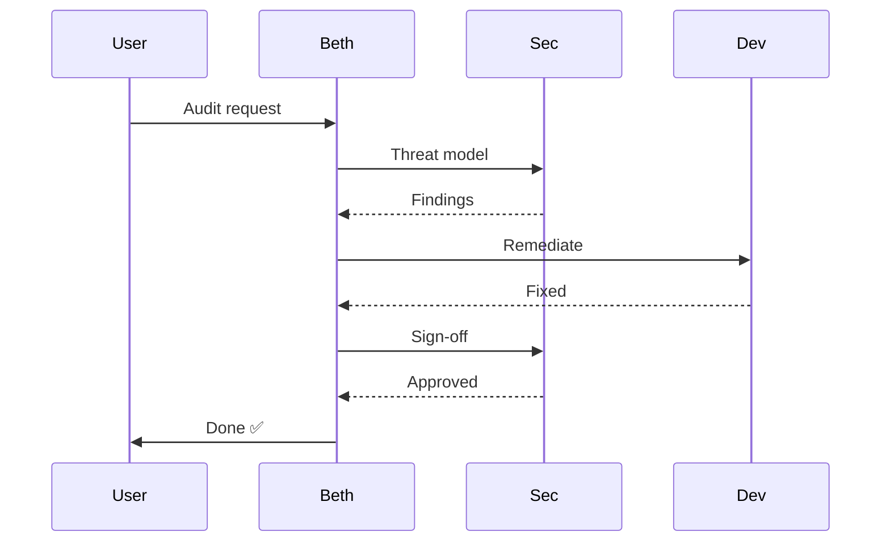
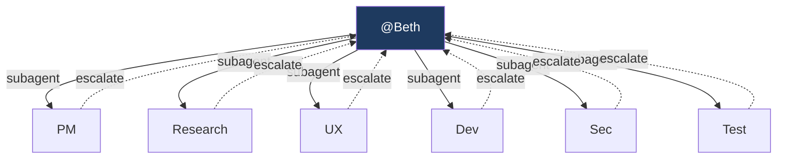
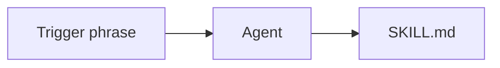
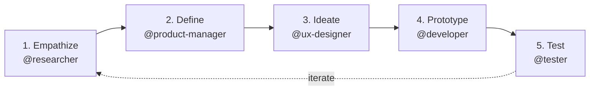
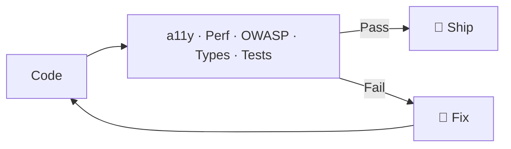

# Beth AI Agent System - Flow Overview

## High-Level Architecture


```mermaid
flowchart LR
    User["User"] --> Beth["@Beth"]
    Beth -->|subagent| PM["PM"] & UX["UX"] & Dev["Dev"] & Sec["Sec"] & Test["Test"] & Res["Research"]
    Beth -.-> Skills["Skills"] & MCP["MCP"]

    style Beth fill:#1e3a5f,color:#fff
```

Beth receives requests, delegates to specialist agents via `runSubagent`, and coordinates results. Agents load skills on-demand and optionally use MCP servers for extended capabilities.

---

## Orchestration Loop


```mermaid
flowchart LR
    Request["Request"] --> Assess --> Spawn["Spawn subagent"]
    Spawn --> Execute --> Results
    Results --> More{More?}
    More -->|Yes| Spawn
    More -->|No| Deliver["Deliver"]
```

---

## Workflows

### New Feature


```mermaid
sequenceDiagram
    participant U as User
    participant B as Beth
    participant PM as PM
    participant UX as UX
    participant D as Dev
    participant S as Sec
    participant T as Test

    U->>B: Request
    B->>PM: Requirements
    PM-->>B: PRD
    B->>UX: Design
    UX-->>B: Specs
    B->>D: Build
    D-->>B: Done
    par Quality gates
        B->>S: Security
        S-->>B: Approved
    and
        B->>T: Verify
        T-->>B: Pass
    end
    B->>U: Ship ✅
```

### Bug Hunt


```mermaid
sequenceDiagram
    participant U as User
    participant B as Beth
    participant T as Test
    participant D as Dev

    U->>B: Bug report
    B->>T: Reproduce
    T-->>B: Confirmed
    B->>D: Fix
    D-->>B: Fixed
    B->>T: Verify
    T-->>B: Pass
    B->>U: Done ✅
```

### Security Audit


```mermaid
sequenceDiagram
    participant U as User
    participant B as Beth
    participant S as Sec
    participant D as Dev

    U->>B: Audit request
    B->>S: Threat model
    S-->>B: Findings
    B->>D: Remediate
    D-->>B: Fixed
    B->>S: Sign-off
    S-->>B: Approved
    B->>U: Done ✅
```

---

## Agent Delegation Graph (Hub-and-Spoke)


```mermaid
flowchart TB
    Beth["@Beth"] -->|subagent| PM["PM"] & Res["Research"] & UX["UX"] & Dev["Dev"] & Sec["Sec"] & Test["Test"]
    PM -.->|escalate| Beth
    Res -.->|escalate| Beth
    UX -.->|escalate| Beth
    Dev -.->|escalate| Beth
    Sec -.->|escalate| Beth
    Test -.->|escalate| Beth

    style Beth fill:#1e3a5f,color:#fff
```

Solid lines = Beth delegates. Dashed lines = agents escalate back to Beth. No lateral handoffs.

---

## Skills Loading


```mermaid
flowchart LR
    Trigger["Trigger phrase"] --> Agent["Agent"] --> Skill["SKILL.md"]
```

| Trigger | Agent | Skill |
| ------- | ----- | ----- |
| "create a PRD" | PM | prd/ |
| "framer component" | UX | framer-components/ |
| "security review" | Sec | security-analysis/ |
| "shadcn button" | Dev | shadcn-ui/ |
| React/Next.js perf | Dev | vercel-react-best-practices/ |
| "review my UI" | UX, Test | web-design-guidelines/ |
| "web search", "competitive analysis" | Research | web-search/ |
| "azure resource", "cloud ops" | Dev | azure-operations/ |

---

## IDEO Design Thinking


```mermaid
flowchart LR
    E["1. Empathize<br/>@researcher"] --> D["2. Define<br/>@product-manager"] --> I["3. Ideate<br/>@ux-designer"] --> P["4. Prototype<br/>@developer"] --> T["5. Test<br/>@tester"]
    T -.->|iterate| E
```

---

## Quality Gates


```mermaid
flowchart LR
    Code["Code"] --> Gates["a11y · Perf · OWASP · Types · Tests"]
    Gates -->|Pass| Ship["🚀 Ship"]
    Gates -->|Fail| Fix["🔧 Fix"] --> Code
```

| Standard | Threshold |
| -------- | --------- |
| WCAG 2.1 AA | Accessibility compliance |
| Core Web Vitals | LCP < 2.5s, FID < 100ms, CLS < 0.1 |
| OWASP Top 10 | Zero known vulnerabilities |
| TypeScript | Strict mode, no `any` |
| Tests | Unit + Integration + E2E |

---

## File Structure

```
beth/
├── bin/cli.js                          # CLI entry point
├── src/
│   ├── cli/commands/                   # close, doctor, land, pre-push-guard, quickstart
│   ├── core/agents/                    # types.ts, loader.ts
│   ├── core/skills/                    # types.ts, loader.ts
│   └── lib/                            # pathValidation
├── templates/
│   └── .github/
│       ├── agents/                     # 7 .agent.md files
│       ├── skills/                     # 6 SKILL.md modules
│       └── copilot-instructions.md
└── docs/
```
```
