# Beth AI Agent System - Flow Overview

## High-Level Architecture

```mermaid
flowchart TB
    subgraph User["👤 User"]
        Request[User Request]
    end

    subgraph Orchestrator["🎯 Beth - The Orchestrator"]
        Beth["@Beth<br/><i>'I don't speak dipshit'</i>"]
        Assess[Assess Request]
        Analyze[Analyze Dependencies]
        Plan[Plan Workflow]
        Route[Route to Specialists]
    end

    subgraph Agents["🧑‍💼 Specialist Agents"]
        PM["@product-manager<br/>WHAT to build"]
        Researcher["@researcher<br/>User/Market Intel"]
        Designer["@ux-designer<br/>HOW it works"]
        Developer["@developer<br/>Implementation"]
        Security["@security-reviewer<br/>Protection"]
        Tester["@tester<br/>Quality Gate"]
    end

    subgraph Skills["📚 Skills (Domain Knowledge)"]
        PRD["PRD Generation"]
        Framer["Framer Components"]
        React["React Best Practices"]
        WebDesign["Web Design Guidelines"]
        SecAnalysis["Security Analysis"]
        ShadcnUI["shadcn/ui"]
    end

    subgraph MCP["🔌 MCP Servers (Optional)"]
        MCPShadcn["shadcn/ui MCP"]
        MCPPlaywright["Playwright MCP"]
        MCPAzure["Azure MCP"]
        MCPWeb["Web Search MCP"]
    end

    subgraph Output["📦 Deliverables"]
        Code[Production Code]
        Tests[Test Suites]
        Docs[Documentation]
        Reports[Security Reports]
    end

    Request --> Beth
    Beth --> Assess --> Analyze --> Plan --> Route
    
    Route --> PM
    Route --> Researcher
    Route --> Designer
    Route --> Developer
    Route --> Security
    Route --> Tester

    PM -.->|loads| PRD
    Designer -.->|loads| Framer
    Designer -.->|loads| WebDesign
    Developer -.->|loads| React
    Developer -.->|loads| ShadcnUI
    Security -.->|loads| SecAnalysis

    Developer -.->|uses| MCPShadcn
    Tester -.->|uses| MCPPlaywright
    Researcher -.->|uses| MCPWeb

    Developer --> Code
    Tester --> Tests
    PM --> Docs
    Security --> Reports
```



## Agent Orchestration Model

Beth runs **everything**. No user intervention required between steps. She spawns subagents, they execute autonomously, report back, and she continues the workflow.

```mermaid
flowchart TB
    subgraph Orchestration["⚡ Beth's Orchestration"]
        direction TB
        B1[Beth receives request]
        B2[Beth analyzes & plans]
        B3[Beth spawns subagent]
        B4[Agent executes autonomously]
        B5[Results returned to Beth]
        B6{More work?}
        B7[Beth delivers results]
        
        B1 --> B2 --> B3 --> B4 --> B5 --> B6
        B6 -->|Yes| B3
        B6 -->|No| B7
    end
```



### Subagent Invocation

```typescript
// Beth spawns specialists as needed
runSubagent({
  agentName: "developer",
  prompt: "Implement the dashboard component with real-time updates...",
  description: "Build dashboard"
})
// Agent works → Returns results → Beth continues
```

## Workflow Patterns

### New Feature Development

```mermaid
sequenceDiagram
    participant U as User
    participant B as Beth
    participant PM as Product Manager
    participant R as Researcher
    participant UX as UX Designer
    participant D as Developer
    participant S as Security
    participant T as Tester

    U->>B: "Build me a feature"
    
    B->>B: Assess & Plan
    
    B->>PM: Define requirements
    PM->>PM: Write PRD, user stories
    PM-->>B: Requirements ready
    
    opt Validate assumptions
        B->>R: Research user needs
        R->>R: Interviews, competitive analysis
        R-->>B: Insights synthesized
    end
    
    B->>UX: Design the experience
    UX->>UX: Component specs, tokens, a11y
    UX-->>B: Design specs ready
    
    B->>D: Implement feature
    D->>D: Build React/Next.js code
    D-->>B: Implementation complete
    
    B->>S: Security review
    S->>S: OWASP audit, threat model
    S-->>B: Security approved
    
    B->>T: Test & verify
    T->>T: Unit, integration, e2e, a11y
    T-->>B: Quality verified
    
    B->>U: Feature complete ✅
```



### Bug Hunt Workflow

```mermaid
sequenceDiagram
    participant U as User
    participant B as Beth
    participant T as Tester
    participant D as Developer
    participant S as Security

    U->>B: "Fix this bug"
    
    B->>T: Reproduce & document
    T->>T: Create reproduction steps
    T-->>B: Bug confirmed
    
    B->>D: Find & fix
    D->>D: Debug, implement fix
    D-->>B: Fix ready
    
    B->>S: Verify no vulnerabilities
    S->>S: Check related security
    S-->>B: Security clear
    
    B->>T: Verify fix
    T->>T: Regression testing
    T-->>B: Fix verified
    
    B->>U: Bug squashed ✅
```



### Security Audit Workflow

```mermaid
sequenceDiagram
    participant U as User
    participant B as Beth
    participant S as Security
    participant D as Developer
    participant T as Tester

    U->>B: "Security review needed"
    
    B->>S: Threat model & audit
    S->>S: STRIDE analysis<br/>OWASP Top 10<br/>Azure WAF review
    S-->>B: Findings documented
    
    loop For each finding
        B->>D: Remediate vulnerability
        D->>D: Implement secure fix
        D-->>B: Fix applied
    end
    
    B->>T: Penetration testing
    T->>T: Attack scenarios<br/>Security test plan
    T-->>B: All tests pass
    
    B->>S: Final sign-off
    S-->>B: Security approved
    
    B->>U: Audit complete ✅
```



## Agent Delegation Graph


## Skills Loading Pattern


## IDEO Design Thinking Integration


## Quality Gates

```mermaid
flowchart TB
    subgraph Standards["Quality Standards"]
        A11y["WCAG 2.1 AA<br/>Accessibility"]
        Perf["Core Web Vitals<br/>LCP < 2.5s"]
        Sec["OWASP Compliant<br/>Zero vulnerabilities"]
        Type["Full TypeScript<br/>No any"]
        Coverage["Test Coverage<br/>Unit + Integration + E2E"]
    end

    subgraph Gates["Enforcement"]
        Designer["UX Designer<br/>reviews a11y specs"]
        Developer["Developer<br/>implements patterns"]
        Security["Security Reviewer<br/>audits code"]
        Tester["Tester<br/>verifies all gates"]
    end

    A11y --> Designer
    Perf --> Developer
    Sec --> Security
    Type --> Developer
    Coverage --> Tester

    Designer --> Ship{Ship?}
    Developer --> Ship
    Security --> Ship
    Tester --> Ship

    Ship -->|All Pass| Deploy["🚀 Deploy"]
    Ship -->|Fail| Fix["🔧 Fix & Retry"]
    Fix --> Gates
```



## File Structure


---

## Summary

**Beth** is the autonomous orchestrator who:

1. **Receives** user requests
2. **Assesses** what's really needed (not just what was asked)
3. **Plans** the optimal workflow
4. **Spawns subagents** to execute work autonomously
5. **Coordinates** results between specialists
6. **Delivers** final results without excuses

No user intervention between steps. Beth runs the show.

The system follows **IDEO Design Thinking** principles:

- **Empathize** → Researcher
- **Define** → Product Manager  
- **Ideate** → UX Designer
- **Prototype** → Developer
- **Test** → Tester + Security

All work passes through **quality gates** enforcing accessibility, performance, security, type safety, and test coverage.

> *"I made two decisions in my life based on fear, and they almost ruined me. I'll never make another."* — Beth
